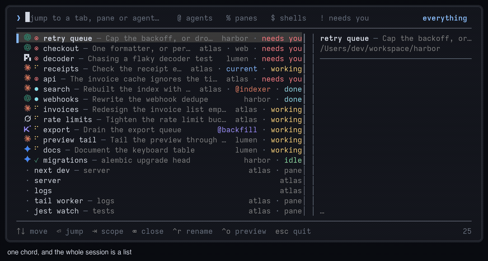

# herdr-bar

[](https://github.com/jeffarese/herdr-bar/actions/workflows/ci.yml)

**Cmd+K for [herdr](https://herdr.dev).** One chord opens a search field over your
session, you type a few letters of a tab, pane, agent, repo or branch, and Enter
takes you there. Like the Slack quick switcher, for the terminal.



- **fuzzy search over everything you can jump to** — agents, plain tabs, and
  workspaces, matched on title, working directory, agent name and kind, branch,
  workspace, and tab number.
- **live status, herdr's own language** — `◉` needs you, spinner working,
  `●` done, `✓` idle. Colors and glyphs mirror the herdr sidebar, and the list
  keeps updating while it is open.
- **agents at a glance** — Claude, Codex, Kimi, Gemini, Cursor and OpenCode
  labels each have a distinct color in mixed-agent sessions.
- **named panes on demand** — `%` switches to one row per pane, led by the
  name you assigned it, and Enter focuses that exact pane.
- **opens on what matters** — blocked and finished agents float to the top,
  recently visited rows above them, and the tab you are in is never first, so
  open-then-Enter works like alt-tab.
- **running time on every row** — how long the agent session, or whatever the
  tab is running, has been up: `47s`, `12m`, `2h04m`, `4d3h`.
- **live preview** — the right column tails the selected pane, so you can look
  before you leap.
- **closes tabs** — `⌦` on a row closes its tab once you confirm, so the
  session you are looking at is the session you can tidy.
- **no dependencies** — Python 3 standard library only. No build step, no
  runtime to install, no daemon.

## Install

```bash
herdr plugin install jeffarese/herdr-bar
```

Then bind a key (herdr does not add keybindings for you). In your herdr
`config.toml`:

```toml
[[keys.command]]
key = "prefix+k"
type = "plugin_action"
command = "herdr-bar.open"
description = "command bar"
```

Reload with `herdr server reload-config`, then press `ctrl+b k`.

Requires herdr 0.7.4+ (the release that added popup plugin panes), Python 3.9+
on PATH, and macOS or Linux. Herdr refuses to install the plugin on anything
older, so there is nothing to get wrong.

## Making it a real Cmd+K

`prefix+k` works everywhere and is the safe default. If you want the physical
Cmd+K, add a second binding for a chord your terminal can actually deliver —
`ctrl+alt` is the one modifier family that is free in every terminal we know of:

```toml
[[keys.command]]
key = ["prefix+k", "ctrl+alt+k"]
type = "plugin_action"
command = "herdr-bar.open"
description = "command bar"
```

…and then teach your terminal to send that chord when you press Cmd+K. On macOS,
Cmd never reaches the program inside the terminal on its own; the terminal has to
translate it. These send what herdr reads as `ctrl+alt+k`:

| Terminal | Setting |
| --- | --- |
| Ghostty | `keybind = cmd+k=text:\x1b[107;7u` in `~/.config/ghostty/config` |
| kitty | `map cmd+k send_text all \x1b[107;7u` |
| WezTerm | `{ key = "k", mods = "CMD", action = wezterm.action.SendString("\x1b[107;7u") }` |
| iTerm2 | Settings → Keys → Key Bindings → `⌘K` → *Send Escape Sequence* → `[107;7u` |
| Terminal.app | No arbitrary key mapping; stay on `prefix+k` |

`\x1b[107;7u` is the CSI-u encoding of `ctrl+alt+k`. If your terminal prefers the
legacy form, `\x1b\x0b` says the same thing. Some terminals can forward Cmd
directly, in which case plain `key = "cmd+k"` in the herdr binding is worth a
try first — it depends on your terminal's keyboard protocol.

Whichever you pick, Cmd+K is likely already taken by the terminal (usually
"clear scrollback"); the mapping above replaces it.

## Using it

| Key | Does |
| --- | --- |
| type | fuzzy search; space separates terms, all of which must match |
| `↑` `↓`, `ctrl+p` `ctrl+n`, `ctrl+k` `ctrl+j` | move |
| `enter` | jump to the selected row and close |
| `esc`, `ctrl+c`, `ctrl+g` | leave, change nothing |
| `tab` / `shift+tab` | cycle the filter |
| `@` `%` `$` `!` on an empty query | filter to agents / panes / plain tabs / rows that need you |
| `backspace` on an empty query | clear the filter, then close the selected row's tab |
| `delete` (fn+`⌫` on a Mac laptop) | close the selected row's tab, whatever is typed |
| `ctrl+u` / `ctrl+w` / `ctrl+d` | clear the query / delete a word / forward delete |
| `ctrl+o` | toggle the preview |
| `ctrl+r` | rename the selected row's tab; Enter saves, Esc keeps the old name |
| `pgup` / `pgdn` | page |
| wheel / click | move / select, click again to jump |

**What is in the list.** Every agent, every tab that has no agent, and — once a
session has more than one — every workspace. Selecting an agent focuses its tab
and its pane; selecting a workspace focuses the workspace.

`% panes` switches to one row per named pane. Unnamed panes stay out of the
list. Named panes also appear in Everything and participate in its searches;
the pane filter narrows the list to just those direct pane targets. Selecting a
pane focuses its tab and that exact pane.

**What a row says.** The tab's own name comes first — that is what you named
the work and what you remember it by — and an agent's current summary follows it
in dimmer text. A narrow row keeps the name and drops the summary; a tab with no
name of its own lets the summary stand in for it. Folder and workspace metadata
is omitted when the same name is already present in the title or summary, and
agent labels use distinct colors so mixed-agent sessions scan quickly.

**Closing a tab.** `backspace` — the key macOS labels *delete* — erases the
query first, then clears the filter, and once there is nothing left to unwind
it arms the close instead. `delete` (fn+`⌫`) arms it whatever is typed. The
footer says what is going; `enter` or `y` does it, `esc` or any other key calls
it off, including the delete keys themselves, so a held key that repeats can
never answer its own question. Rows are per agent but tabs are what close, so a
tab running two agents says so before it takes both. Workspaces cannot be
closed from the bar.

**Running time.** The number next to a row is how long its process has been
running: the agent session for an agent, the running command — or the shell
itself, which reads as the age of the tab — for a plain tab. Herdr keeps no
clocks, so this comes from the operating system, once per pane; a status that
changed a minute ago on a two-hour-old session still says two hours.

**How it is ordered.** With no query: recently visited rows first, then rows that
want your attention (blocked, then done, then working), then the rest by
workspace and tab number. The tab you are currently in is never first. With a
query: best fuzzy score wins, ties broken by recency and then status. Matches in
the title outrank matches in a working directory or an agent name. Matched
characters are drawn bold, colored and underlined wherever the row shows the
text they landed in — the tab name, the summary, the directory, the agent — so a
subsequence scattered across a sentence still reads as one, and a row that
matched on something off screen simply shows no highlight.

## Configuring

Optional. Write `config.json` in the plugin config directory
(`herdr plugin config-dir herdr-bar`):

```json
{
  "preview": "auto",
  "mouse": true,
  "spinner": true,
  "refresh_ms": 900,
  "workspaces": "auto",
  "selection_background": "auto",
  "colors": {
    "accent": "#89b4fa",
    "match": "#89b4fa",
    "muted": "bright_black"
  }
}
```

| Key | Default | Meaning |
| --- | --- | --- |
| `preview` | `"auto"` | `true`, `false` (hidden until `ctrl+o`), or `"auto"` (on when the popup is wide enough) |
| `mouse` | `true` | click and wheel support |
| `spinner` | `true` | animate the working glyph |
| `refresh_ms` | `900` | how often the open bar re-reads the session |
| `workspaces` | `"auto"` | `true`, `false`, or `"auto"` (on with more than one workspace) |
| `selection_background` | `"auto"` | `"auto"` asks the terminal for its background color, or set `"none"`, a hex value, or a 0-255 ANSI index |
| `colors` | `{}` | role → `#rrggbb`, an ANSI name (`bright_blue`), or 0-255. Roles: `accent`, `match`, `text`, `muted`, `blocked`, `working`, `done`, `idle`, `unknown`, plus `agent_claude`, `agent_codex`, `agent_kimi`, `agent_gemini`, `agent_cursor`, `agent_opencode` |

Colors default to plain ANSI, so the bar follows whatever theme your terminal
already uses. The exception is `muted` — the second tier of text, used for
summaries and running times — which is a gray picked from the
terminal's own background (lighter on a dark theme, darker on a light one) so it
stays readable; agent labels use their agent role, and `unknown` is the dimmer
tier below it for separators and rules.

Popup size lives in herdr, not here. Override the manifest's `74%` × `62%` per
invocation with `herdr plugin pane open --plugin herdr-bar --entrypoint bar
--placement popup --width 60% --height 50%`.

## How it works

The bar is one short-lived process in a herdr popup pane. It reads the whole
session in a single `session.snapshot` call over herdr's Unix socket (~15ms),
re-reads it while it is open so statuses stay live, tails the selected pane with
`pane.read` for the preview, and calls `tab.focus`, `pane.focus`, `agent.focus`,
or `workspace.focus` when you press Enter, or `tab.close` when you confirm a
delete. Running times come from `pane.process_info` plus `ps`, one reading per
pane on the way onto the screen and then ticked locally, because a start time
never moves. If the socket is unavailable it falls back to the `herdr` CLI.
Nothing runs in the background, and the only state it keeps is a list of
recently visited rows under `HERDR_PLUGIN_STATE_DIR`.

## Development

```bash
git clone https://github.com/jeffarese/herdr-bar
cd herdr-bar
herdr plugin link .

PYTHONPATH=src python3 -m unittest discover -s tests -t .   # 300, no deps
python3 run.py --doctor                         # environment diagnostics
python3 run.py --list                           # the rows, as JSON
python3 scripts/demo.py                         # run against fixture data
python3 scripts/demo.py --frame --plain         # print one static frame
ruff check .                                    # lint, if you have it
```

`scripts/demo.py` needs no herdr server, which makes it the fastest way to work
on the UI. `herdr plugin log list --plugin herdr-bar` shows what herdr
recorded when it launched the plugin.

## Goes well with

[herdr-newtab-plus](https://github.com/jeffarese/herdr-newtab-plus) is the
other half of the loop. This bar jumps you to the tabs you already have; that
plugin opens the one you don't — it asks which folder and which agent,
completes real paths, remembers where you work, and starts the agent for you.

## License

MIT. See [LICENSE](LICENSE).
